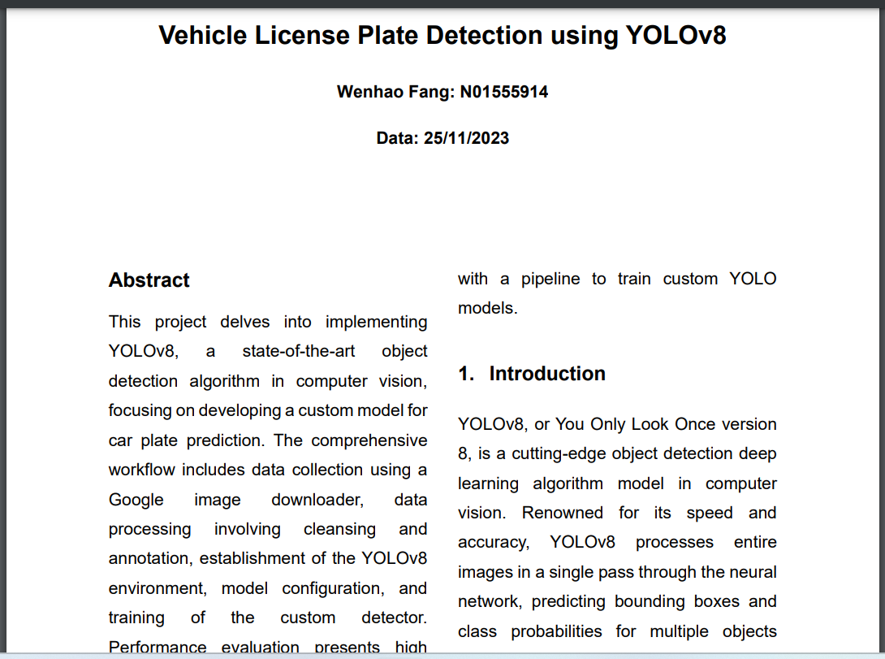
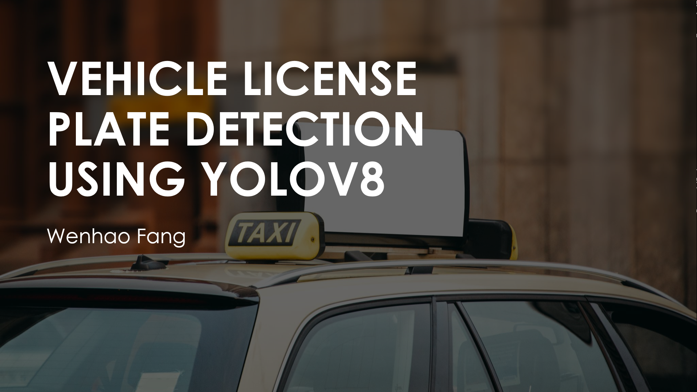
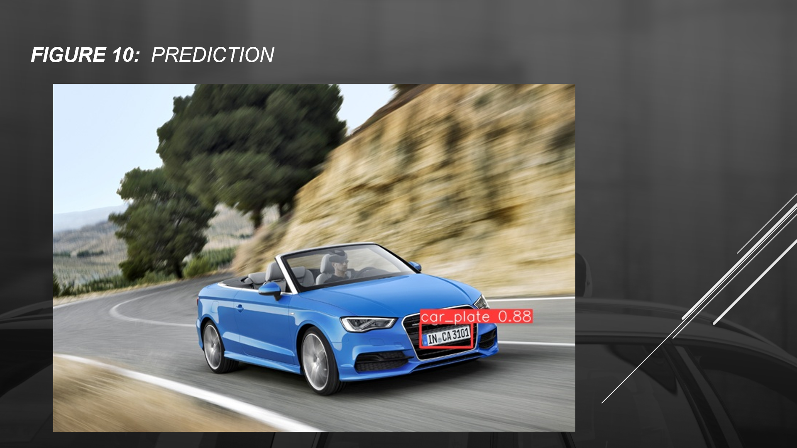

# ITE-5310-Machine-Learning-Assignment10

Project for Machine learning course, Humber ITS

- Test:

  - [x] Download images
  - [x] Label
  - [x] Split
  - [x] Configure

- Documents: /doc

---

- Report:
  - **Vehicle License Plate Detection using YOLOv8**
  - doc/Group7_Report.pdf

- PPT
  - doc/Group7_Presentation.pdf

